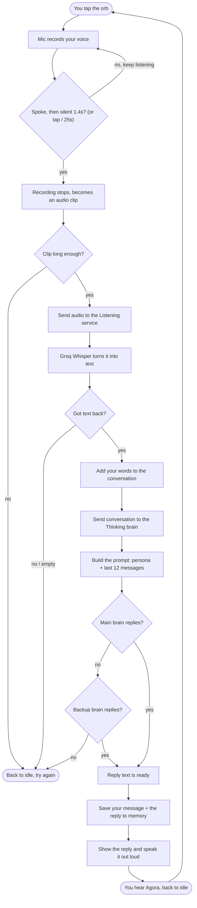
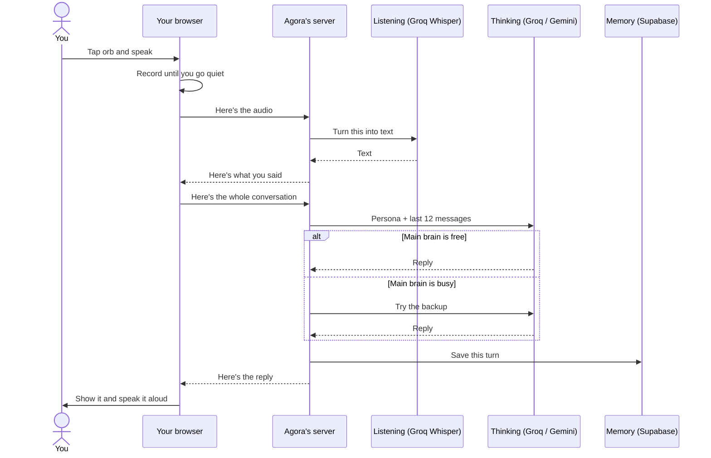

# Agora — MVP, explained simply

Agora is a **voice buddy for history nerds**. You tap a button, talk to it out loud, and it talks back — with opinions, pushback, and real history. Think of it as a friend who happens to know a frightening amount about Rome, the Mughals, the Mongols, and everything in between.

This document explains **what we built, why we built it this way, and what's deliberately temporary** — in plain language, no jargon.

---

## At a glance

| | |
|---|---|
| **What it is** | Talk to a history buddy with your voice; it replies in voice |
| **Status** | MVP (part 1) — working and live |
| **Live link** | https://agoraaa.vercel.app |
| **Cost to run** | ₹0 (everything is on free tiers) |
| **Works in** | Chrome, Edge, Brave (needs a microphone) |

> **One important thing up front:** almost every service below was chosen because it's **free and fast to set up**, not because it's the best. The MVP's job is to prove the idea works. Several pieces are **placeholders we plan to swap for better services later** — each is marked clearly.

---

## What we built

A full voice conversation loop that actually works:

1. You **speak** → it hears you
2. It **thinks** → a history-savvy "brain" writes a reply
3. It **talks back** → you hear the answer out loud
4. It **remembers** → your conversation is saved and comes back when you return

That's the whole MVP. Simple on the surface, a few moving parts underneath.

---

## The pieces (and why each one is temporary)

Here's every part of Agora, what it does in plain words, what we're using **right now**, why we picked it, and what we plan to **upgrade to later**.

| Part | What it does | Using now (MVP) | Why this, for now | Planned upgrade |
|---|---|---|---|---|
| **Listening** *(speech → text)* | Turns your spoken words into written text | **Groq Whisper** | Free, accurate, and works in **every** browser | Possibly a real-time listening service for lower delay |
| **Thinking** *(the brain)* | Reads the conversation and writes a reply | **Groq** model, with **Gemini** as a backup | Free and **very fast**; backup keeps it running if one is busy | A stronger model for richer, deeper answers |
| **Talking** *(text → speech)* | Turns the reply into a voice you hear | **The browser's built-in voice** | Free, zero setup | A **natural neural voice** — the current one sounds robotic |
| **Memory** *(storage)* | Saves your chats so they come back later | **Supabase** (a hosted database) | Free, reliable, simple to use | Same database, with smarter memory added on top |
| **Home** *(hosting)* | Where the app lives on the internet | **Vercel** | Free, one-click deploy, secure by default | Staying — it's a great fit |

**The short version of "why":** every choice optimizes for *free, fast, and good-enough* so we could get a working thing in front of real use quickly. We'll trade "good-enough" pieces for "genuinely great" ones once the idea is proven.

---

## How it works, step by step

Here's exactly what happens from the moment you tap the button to the moment you hear a reply:

1. **You tap the orb** and start talking.
2. The app **records your voice** and watches the volume. When you go quiet for about 1.4 seconds (or tap again), it knows you're done and **stops recording**.
3. Your audio is sent to the **Listening** service, which turns it into **text**.
4. That text is added to the conversation and sent to the **Thinking** brain, along with the **persona** (the "be an opinionated history nerd" instructions) and the **last 12 messages** so it remembers the thread.
5. The brain **writes a reply**. If the main brain is busy, the **backup** takes over automatically.
6. Your message and the reply are **saved to memory**.
7. The reply appears on screen and is **spoken out loud**.
8. The app returns to idle, ready for your next question. The loop repeats.

If anything goes wrong along the way — mic blocked, nothing heard, both brains busy — it simply shows a short message and resets, so you can try again.

---

## The full flow (diagram)

---

## The same thing, as a conversation between the parts

This shows who talks to whom during a single turn:

---

## What it remembers (and what it doesn't — yet)

**Today:** Agora remembers the **current conversation**. Every message is saved to the database, and when you come back, your last chat loads right up. The "New chat" button starts fresh.

**Not yet:** it doesn't truly remember **you** across different conversations. If you tell it "my favorite era is the Mughals" today and start a brand-new chat next week, it won't recall that on its own. Making it remember *you* — your interests and pet theories — is the **next big upgrade** (see below).

---

## Honest limitations of the MVP

These are known and okay — an MVP is meant to be rough in places:

- **The voice sounds robotic.** It's the browser's built-in voice. A natural voice is a planned upgrade.
- **Small delay before it replies.** Your audio has to be turned into text first. We can make this faster later.
- **No long-term memory of you** across separate chats (explained above).
- **No "modes" yet** — like a dedicated Debate mode or Fact-check mode. Coming.
- **The link is open.** Anyone with the URL can use it. Fine while it's private; we'll add a simple lock before sharing it widely.
- **Desktop browsers only** (Chrome, Edge, Brave) with a microphone.

---

## What's next

In rough priority order:

1. **Remember *you*** — a running summary of long chats, plus long-term facts (like "favorite era = Mughals") that carry across every future conversation.
2. **Modes** — switch between just chatting, debating, fact-checking a myth, or going deep on a topic.
3. **Feels premium** — a natural voice, faster replies (it starts talking sooner), and a nicer animated orb.
4. **A simple lock** on the link before sharing it publicly.

---

## Why build it this way at all?

Because the goal of an MVP isn't to be perfect — it's to **answer one question fast: does this actually feel good to use?** By leaning on free, fast, simple services, we got a real, working, voice-in-voice-out history buddy live on the internet without spending a rupee. Now that the idea is proven, we can invest in the pieces that make it genuinely great.
