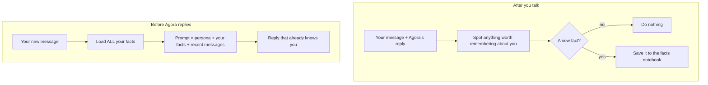
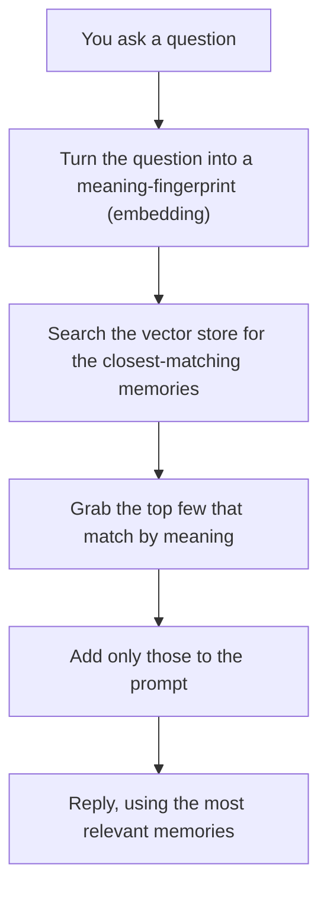

# Agora — what we build next

This is the **step-by-step plan** for everything after the MVP, in the order we'll build it. Plain language, with the technical bits explained as they come up. Each step says **what**, **why**, **how it works**, and **what we add to the code/database**.

> **The golden rule that shapes all the memory steps:**
> **If the notes fit inside the prompt, just load them all — you don't need vectors, embeddings, or a RAG pipeline.** You only reach for that heavier machinery when there's *too much* to fit. We'll start simple and upgrade only when the data actually demands it.

---

## The order of operations

| # | Step | What it gives you | Size | Needs RAG? |
|---|---|---|---|---|
| 1 | **Remember you (simple)** | Agora recalls facts about you across chats | Small | ❌ No |
| 2 | **Remember long chats** | It won't forget the start of a 2-hour talk | Small | ❌ No |
| 3 | **Smart memory (RAG)** | Search your whole history *by meaning* | Medium | ✅ Yes |
| 4 | **Modes** | Debate / Fact-check / Rabbit-hole | Medium | ❌ No |
| 5 | **Feels premium** | Natural voice, faster replies, nicer orb | Medium | ❌ No |
| 6 | **Lock the door** | A passphrase before sharing publicly | Tiny | ❌ No |

---

## Step 1 — Remember *you* (the simple version)

**What:** Agora remembers facts about *you* — your favorite eras, your pet theories — across completely separate conversations.

**Why:** Right now it forgets you between chats. This is the single upgrade that turns it from "a chatbot" into "*my* history buddy."

**How it works — a little notebook:**
- **After you talk**, Agora looks at what was said and picks out anything worth remembering about you, then writes it to a `facts` notebook in the database.
- **Before Agora replies**, it loads *all* your facts from the notebook and includes them in the prompt — so it already knows you.

Because one person has only a handful of facts, we just load **all of them** every time. **No vectors, no search, no RAG.** Just a plain database read.



**What we add:**
- A new table:
  ```sql
  create table facts (
    id uuid primary key default gen_random_uuid(),
    content text not null,          -- e.g. "Loves the Mughal era"
    created_at timestamptz default now()
  );
  ```
- A small step in the server that extracts facts after a turn, and a tweak that loads facts into the prompt.

---

## Step 2 — Remember *long* conversations

**What:** Keep the thread coherent even in a very long chat.

**Why:** Today we send the model the **last 12 messages**. In a long conversation, the early part scrolls out of view and Agora "forgets" how the chat started.

**How it works — a running summary:**
- As the conversation grows, we quietly **summarize the older messages** into a short paragraph and save it.
- The prompt becomes: **persona + your facts + summary of older stuff + the most recent messages.**

This keeps long chats both **coherent** (nothing is forgotten) and **cheap** (we never resend the entire history).

**What we add:**
- A table:
  ```sql
  create table summaries (
    session_id uuid references sessions(id) on delete cascade,
    summary text,
    updated_at timestamptz default now()
  );
  ```

### How the prompt grows across steps

| Stage | What the brain receives |
|---|---|
| **MVP (now)** | persona + last 12 messages |
| **After Step 1** | persona + **your facts** + last 12 messages |
| **After Step 2** | persona + your facts + **summary of older** + recent messages |
| **After Step 3** | persona + your facts + **relevant memories (searched by meaning)** + recent messages |

---

## Step 3 — Smart memory (the RAG upgrade) — *future*

This is the step with all the "fancy" words. We build it **only when it's actually needed** — when there's so much saved history that it no longer fits in the prompt, or when you want Agora to answer things like *"what did we argue about Rome three months ago?"*

**What it adds:** the ability to search your **entire history by meaning**, not just exact words, and pull in only the most relevant bits.

**The jargon, explained plainly:**

| Term | What it really means |
|---|---|
| **Embedding** | Turning a sentence into a list of numbers that captures its *meaning*, so similar ideas sit near each other |
| **Vector database** | A store for those numbers that's fast at "find the most similar ones" |
| **Chunking** | Chopping long text into bite-sized pieces before storing |
| **Retrieval (the "R" in RAG)** | Fetching the few most relevant pieces for the current question |
| **RAG** | *Retrieval-Augmented Generation* — fetch the relevant bits, then let the model answer using them |

**How it works:**



**What we add:**
- Supabase has vector search built in (an extension called **pgvector**), so we stay in the same database.
- We store a **meaning-fingerprint** alongside each memory, and fetch the closest matches at reply time.

> **Why wait?** Because until you have a lot of history, loading everything (Steps 1–2) is simpler, cheaper, and works just as well. RAG is the right tool only once the data outgrows the prompt. *(It's also a genuinely valuable skill to build — a good one to save for when it's justified.)*

---

## Step 4 — Modes

**What:** Switch Agora's "gear" with a toggle:
- **Hang** — free-flowing chat (today's default)
- **Debate** — it takes the opposite side and holds its ground
- **Fact-check** — "did Nero really fiddle?" → sources, myth vs. fact, honest confidence
- **Rabbit hole** — go deep on one topic

**How it works:** each mode is just a **different set of instructions** swapped into the persona, plus a button in the UI. The voice, memory, and flow underneath stay exactly the same.

---

## Step 5 — Make it feel premium

- **Natural voice** — replace the robotic built-in voice with a real neural voice.
- **Faster replies** — start speaking as soon as the first sentence is ready, instead of waiting for the whole answer.
- **A living orb** — have the orb pulse with the voice, and let you **talk over it** to interrupt.

---

## Step 6 — Lock the door

**What:** A simple passphrase so only you (and people you choose) can use the live link.

**Why:** The moment the public URL is shared, strangers and bots could use your free quotas. Not urgent while the link is private — essential **before** you put it on a resume or post it anywhere.

---

## The one-line summary

Start by **loading everything** (simple and great for a long time). Add a **rolling summary** so long chats stay sharp. Reach for **RAG and vectors only when the memory outgrows the prompt**. Everything else — modes, voice, speed — is polish on top of a loop that already works.
